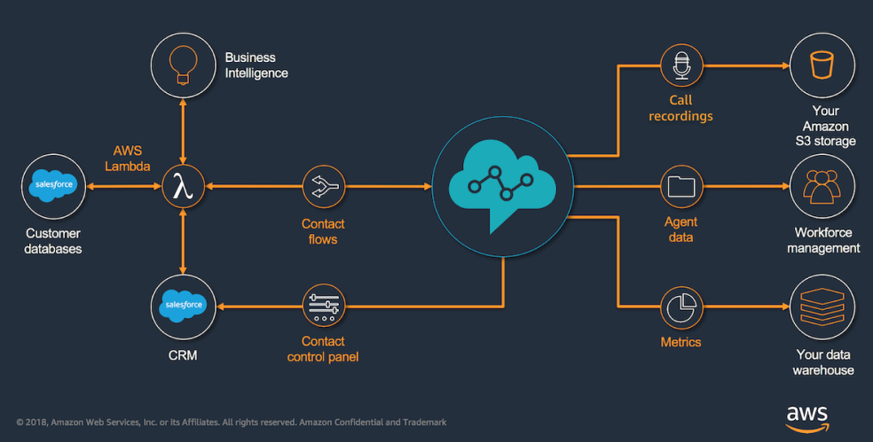

# Amazon Connect Salesforce Lambda

The core functionality of the Amazon Connect CTI Adapter provides a WebRTC browser-based Contact Control Panel (CCP) within Salesforce. The Amazon Connect CTI integration consists of two components, a managed [Salesforce package](https://appexchange.salesforce.com/listingDetail?listingId=a0N3A00000EJH4yUAH) and an [AWS Serverless application](https://serverlessrepo.aws.amazon.com/applications/arn:aws:serverlessrepo:us-west-2:821825267871:applications~AmazonConnectSalesforceLambda), which can be deployed to your AWS environment. 

With those components, customers can build a deep integration between the Amazon Connect contact center platform and Salesforce, the leading customer relationship management (CRM) platform. The collection of pre-build utilities enables a rapid integration between these two platforms. The AWS Serverless application package contains a set of common Lambda functions to be used by Amazon Connect to interact with Salesforce, allowing lookup, create and update operations for different Salesforce objects, like Contacts and Cases.

The key benefits of the adapter:
* Agent state synchronization between Salesforce Omni and Amazon Connect
* Provide valuable information to the agent through configurable view of call attributes
* Utilize the Amazon Connect Call Campaign Object for automated outbound dialling
* Automatically create phone call tasks and relate it to the right Salesforce object
* Embed Amazon Connect Call Recordings in the Salesforce record
* Automatically clean-up open tabs to improve agent efficiency
* Support Salesforce Sales and Service Console in Classic and Lightening
* Amazon Connect CTR import
* Amazon Connect Realtime Queue metrics
* Amazon Connect Post-call transcription

## AWS Serverless Application Repository

The AWS Serverless Application Repository enables you to quickly deploy code samples, components, and complete applications. Each application is packaged with an AWS Serverless Application Model (SAM) template that defines the AWS resources used. There is no additional charge to use the Serverless Application Repository - you only pay for the AWS resources used in the applications you deploy.

For more information, please see the [AppExchange listing](https://appexchange.salesforce.com/listingDetail?listingId=a0N3A00000EJH4yUAH) and our [Quick Start Guide](https://docs.aws.amazon.com/connect/latest/adminguide/salesforce-integration.html).

## Security

See [CONTRIBUTING](CONTRIBUTING.md#security-issue-notifications) for more information.

## License

This project is licensed under the Apache-2.0 License.

